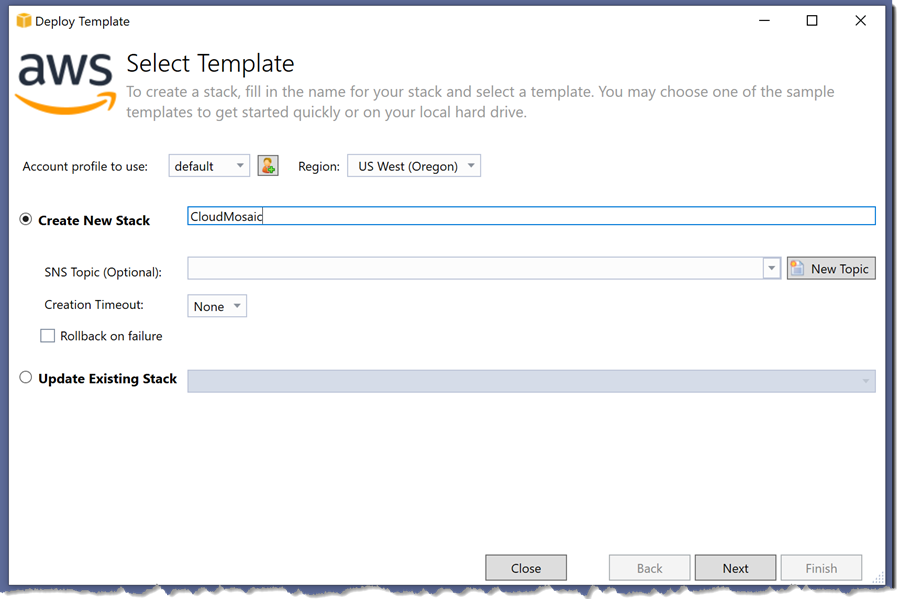

# Module 2: Setup application roles and settings

With the tools and credentials setup completed you can now proceed to deploy the application to AWS in this and subsequent modules in this guide.

## Setup pre-requisite roles and other configuration resources

The sample application is hosted in a virtual private cloud (VPC) and requires several role and other configuration resources to be created. We have defined these assets in an AWS CloudFormation template that you can deploy as follows.

1. Using Visual Studio or the AWS CloudFormation Console, deploy a stack using the *Application/CloudFormationTemplates/CloudMosaic-resources.template* contained in the sample files.

    > Note: If you are using Visual Studio you can deploy the stack by right-clicking on the template file in the solution and selecting *Deploy to AWS CloudFormation*. This will launch the deployment wizard as shown below.

1. In the wizard, select the credentials to deploy with and the region in which the assets will be created.
1. Enter a name for the stack.

    > Note: We suggest using the name **CloudMosaic**. The stack name is used to also name many of the resources it creates so if you choose a different name be sure to adjust the instructions in later modules as required.

    

1. Click **Next** to review the settings, then click **Finish** to close the wizard and start the deployment.

## Setup the Amazon Cognito User Pool

While the stack is being created, setup a new Amazon Cognito User Pool to allow users to register and login to the sample application when it is deployed as follows.

1. Navigate to the Cognito home page in the AWS Management Console
    * Select *Services* and enter the text **Cognito** into the search bar.
    * Click the resulting entry that is returned.
1. Click **Manage User Pools**
1. Click **Create a user pool**
1. Give the pool a name, then click **Review defaults**
1. Click **Add app client...**
1. Enter a name for the client (for example *CloudMosaicWebUI*), leave the rest of the settings at their default values and then click **Create app client**.
1. Click **Return to pool details**.
1. Click **Create pool**.
1. After the pool has been created make a note of the following values:
    * From the *General Settings* page:
        * **User Pool id**

        

    * From the App Clients page (click *App clients* in left-hand navigation pane to view this page):
        * **App client id**
        * **App client secret** (click *Show Details* to view)

        

1. Navigate to the Systems Manager dashboard
    * Select *Services* and enter the text **Systems** into the search field.
    * Select *Systems Manager* from the results.
1. From the Systems Manager dashboard, scroll through the options on the left navigation panel and select *Parameter Store*.
1. Create parameters for the user pool values you made a note of, as follows:
    * Add the first parameter, of string type, with name **/CloudMosaic/AWS/UserPoolId** and value set to the *Pool id you recorded*, for example:

        

    * Add a second parameter, again a string type, with name **/CloudMosaic/AWS/UserPoolClientId** and value *App client id you recorded*
    * Add a third parameter, this time a SecureString type, with name **/CloudMosaic/AWS/UserPoolClientSecret** and value *App client secret you recorded*.

        > Note: For this workshop you can select to use the default KMS key for your account to encrypt the value.

***You have now completed this module and can move onto the next.***
