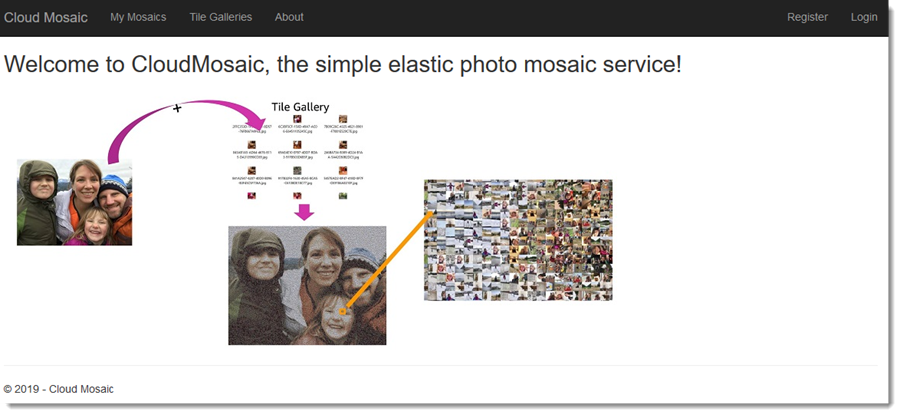

# Module 6: Test the deployed application

In this module you will register a user and then create a new tile gallery and mosaic image using the deployed web application front-end. In the previous module you accessed the application using either the URL displayed in Visual Studio's Cluster view for the application or via the Load Balancer settings in the AWS Management Console. If you closed the web browser, open it again following the instructions in the previous module.

## Step 1: Register a user

1. Click **Register** in the application banner.
1. In the resulting form:
    1. For *UserName* use the id you used in modules 3 and 4 when creating a test gallery and a test mosaic.
    1. Enter a valid email address.
    1. Enter a password for the user.
    1. Click **Register**.

Amazon Cognito will now send a code to the email address you specified to confirm your account. To show the account is currently unconfirmed:

1. Open the AWS Management Console, navigate to the Cognito home page and click **Manage User Pools**.
1. Select the pool.
1. Click **Users and groups**.
1. Your new user should be listed as currently unconfirmed.
1. Open your email and get the code that was mailed to you, then enter it into the field in the application's pending confirmation page.
1. Click **Confirm**.
1. Your user account is now active and logged in.
1. *(Optional)* Return to the Cognito pool page, refresh and verify that the user is now confirmed.

To login as the same user in future, click the *Login* option in the application banner and sign in with the user account you registered. Or you may register additional users.

## Step 2: Create a new tile gallery

1. Click the *Tile Galleries* link.
   > Note: If you used the same user id to register as was used in the test runs in earlier modules you should see an unnamed gallery - this is the output from the batch job test you ran in module 3.
1. Click the **Create New Gallery* link.
1. Fill in a gallery name and browse to select a zip file containing images to be added to the gallery.
    > Note: the sample application currently uses simple file upload which by default in ASP.NET Core is limited to around a 29Mb. You can use larger tile galleries by dividing the images for a gallery into multiple sub-30MB zip files, and then using the Edit Gallery process to add additional zip files of tiles to an existing gallery.
1. Click **Save** to start the tile ingestion process discussed in module 3.

Refresh the page after a while and you should see the gallery be declared Ready under Status (depending on the number of files in the gallery, this can take a few minutes). You can also visit the Batch dashboard in the console and view the status of the running job as well as the Lambda function being invoked as each image is extracted from the zip file and uploaded to S3.

## Step 3: Generate a mosaic

1. Click the *My Mosaics* link.
    > Note: If you used the same user id to register as was used in the test runs in earlier modules you should see an unnamed mosaic - this is the output from the test you ran in module 4.
1. Click **Create New Mosaic**.
1. Browse to select the image you want to render as a mosaic.
1. Select the tile gallery you want to use.
1. Give the mosaic an optional name.
1. Click **Save**.

You'll need to refresh the page a few times until the mosaic is listed as ready. When this happens:

1. Click the generated mosaic.
1. Zoom in to show the tiles it is made up of.

***You have now completed this module and can move onto [module 7](./Module7.md).***
