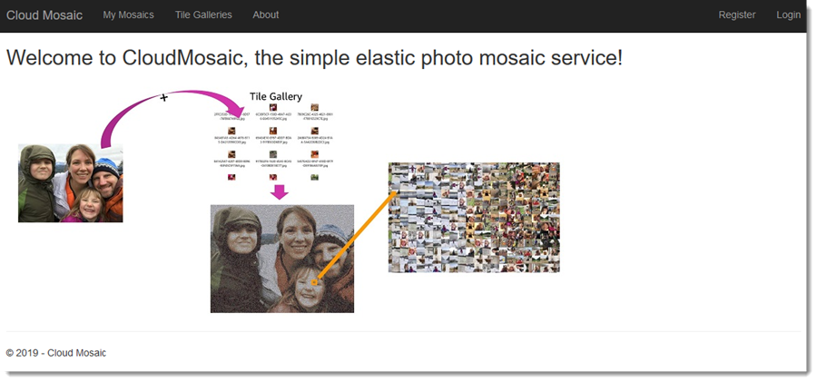
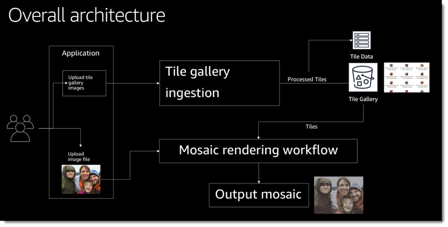

# .NET on AWS: Building End-to-End Serverless .NET Applications

This guide presents the CloudMosaic serverless demo application first shown in the AWS re:Invent 2018 session [Developing with .NET Core on AWS: What's New](https://www.youtube.com/watch?v=FteCJQcTDc4) and subsequently at various AWS Summits and events. The guide acts as a workshop with the modules and steps to follow to deploy the application in your own account.

> Note: the CI/CD content from the original re:Invent session is not currently discussed in this sample but the necessary AWS CodeBuild files have been retained alongside the code assets for reference.



CloudMosaic is an application that enables registered and signed-in users to create mosaicked images. A mosaicked image is one in which blocks of pixels in the original source image are replaced by smaller image tiles, selected from a user-specified tile gallery. Users can upload zip files containing images to be processed and used as tiles in galleries. When a user zooms into a mosaicked image they can see the individual tile images that make up the mosaic.

The sample illustrates modern, serverless, .NET Core applications on [AWS](https://aws.amazon.com/). It uses the [AWS SDK for .NET](https://docs.aws.amazon.com/sdk-for-net/) to work with AWS services from within application code, as well as [tools from AWS](https://aws.amazon.com/developer/language/net/tools/) to integrate with Visual Studio (on Windows) and the dotnet CLI (on Windows, macOS, and Linux) to make working with serverless application development on AWS easy and convenient.

Following the instructions in this sample you will gain experience in deploying to and using the following AWS services, using the tools you are already familiar with, namely Visual Studio and AWS extensions for the dotnet CLI:

* [Amazon Cognito](https://aws.amazon.com/cognito/)
* [Amazon DynamoDB](https://aws.amazon.com/dynamodb/)
* [AWS Batch](https://aws.amazon.com/batch/)
* [AWS Fargate](https://aws.amazon.com/fargate/)
* [AWS Lambda](https://aws.amazon.com/lambda/)
* [AWS Step Functions](https://aws.amazon.com/step-functions/)
* [AWS Systems Manager](https://aws.amazon.com/systems-manager)

The instructions in this sample can be used by those working on Windows, macOS, or Linux.

The overall architecture of the application is shown below. Individual modules will dive into the architecture of the three primary subsystems (tile gallery ingestion, mosaic rendering workflow, and web front-end).



## Prerequisite installations

To perform the steps in this guide on Windows, macOS or Linux we recommend you install the following software before starting:

### Windows Users

* [Visual Studio 2019](https://visualstudio.microsoft.com/) (the free community edition of Visual Studio is sufficient).
    > Note 1: The IDE must be installed with the .NET Core, ASP.NET Core and F# workloads.\
    > Note 2: If you are using Windows but do not want to use Visual Studio, you can install the .NET Core SDK (AWS Lambda supports .NET Core 2.1) and use the AWS extensions for the dotnet CLI  (see below).
* [AWS extensions for the dotnet CLI](https://github.com/aws/aws-extensions-for-dotnet-cli):
  * To install the tools needed for this guide run the commands

    ```powershell
    dotnet tool install -g Amazon.Lambda.Tools
    dotnet tool install -g Amazon.ECS.Tools
    ```

* [Docker for Windows](https://docs.docker.com/docker-for-windows/install/)
  > Note 1: Linux-based containers will be used in this guide.\
  > Note 2: After installing, be sure to log out and log back in again so that your user account is correctly updated to work with Docker.\
  > Note 3: If you are using Windows 10 Home, please install [Docker Toolbox](https://docs.docker.com/toolbox/toolbox_install_windows/) instead as Docker for Windows is not supported on Windows 10 Home.

### macOS or Linux Users

* [.NET Core SDK](https://dotnet.microsoft.com/download)
  > Note: AWS Lambda supports .NET Core 2.1
* [AWS extensions for the dotnet CLI](https://github.com/aws/aws-extensions-for-dotnet-cli):
  * To install the tools needed for this guide run the commands

    ```bash
    dotnet tool install -g Amazon.Lambda.Tools
    dotnet tool install -g Amazon.ECS.Tools
    ```

* [Docker Desktop for Mac](https://docs.docker.com/docker-for-mac/install/)
* [Docker for Linux](https://docs.docker.com/v17.12/install/)

## This Guide

The guide consists of a series of modules that you should work through in order to configure and deploy the sample application to AWS. Module 1 is used to set up the AWS tools and user credentials for the remaining modules. If you already have these configured you can skip straight to module 2 to begin the guide.

> **Important Note:** This guide creates chargeable AWS resources. You may wish to remove these resources upon completion of the guide to avoid incurring future charges to your account. To do this, be sure to follow the instructions in *Module 7: Resource cleanup*.

## Modules

Follow the modules in order to successfully configure and deploy the sample application to AWS.

* [Module 1: Setup the AWS tools and user credentials](Module1.md)
* [Module 2: Setup application roles and settings](Module2.md)
* [Module 3: Tile gallery ingestion subsystem](Module3.md)
* [Module 4: Image to Mosaic Workflow](Module4.md)
* [Module 5: Deploy web app front end on AWS Fargate](Module5.md)
* [Module 6: Test the deployed application](Module6.md)
* [Module 7: Resource cleanup](Module7.md)
